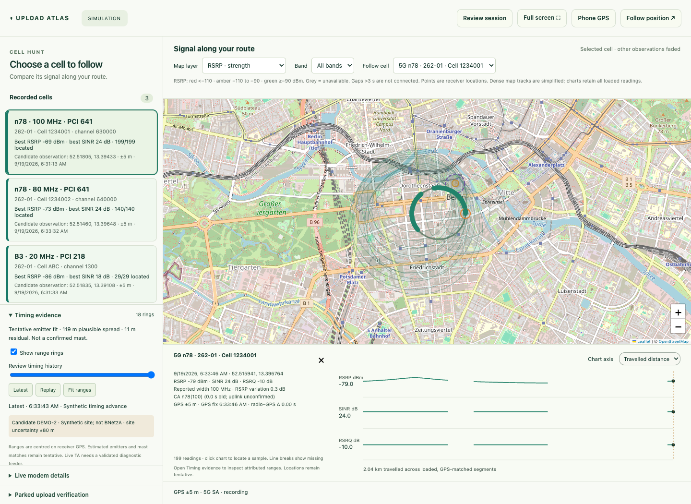

# Mudi cell hunt — integrated branch

A passive drive-survey app for discovering promising cellular upload locations. This branch starts with the newest local **Upload Atlas** app, keeps its radio maps and linked charts, and adds identity, timing and recording improvements from **Uplink Atlas**. The original scripts remain available separately.



## Preview

Python 3.10+; runtime uses the standard library, SSH, curl and vendored Leaflet.

```sh
python3 drive_app.py --demo --port 8787
```

Open http://localhost:8787. The demo seeds a drive, two n78 cells that share a PCI but have different full identities, unresolved NSA sightings, synthetic timing ranges and synthetic mast candidates. No modem or speed-test requests run in demo mode; OpenStreetMap tiles still use the network.

## Start a real survey

```sh
python3 drive_app.py --iface en12 --db data/drive.sqlite3 --port 8787
```

Create `data/` if needed (the journal also creates its parent directory). The Mac must have key-based SSH access to `root@192.168.8.1`, with the router host key verified. `--ssh-known-hosts FILE` can select an existing trusted file. The app never bypasses host-key verification. Set `--iface` to the actual Mudi interface before any optional upload verification; `en12` is a default, not autodetection.

GPS and radio collection begin immediately. No automatic bandwidth tests, band changes, forced network re-registration, or diagnostic-router restarts occur in this app. Passive interface counters describe all outgoing traffic, not upload capacity.

On desktop, the app opens directly into the cell-hunting map:

- Select a full cell identity in the sidebar or map selector. Observation points are receiver GPS locations.
- Change between RSRP, RSRQ, calibrated SINR when available, signal variation, reported width, bands and scouting clues. All reported bands remain eligible; n78 is not a speed guarantee.
- Click a route point or signal chart to inspect its measurements. Charts support time and travelled-distance axes and break across gaps and separate visits.
- Open **Live modem details** for neighbours, aggregation and raw firmware values.
- Open **Timing evidence** for attributed range rings, tentative fits, candidate mast matches and history replay. **Latest** resumes following the current evidence.
- **Phone GPS** provides a simpler foreground location-sharing display. **Review session** opens the broader dashboard and export controls.

## Full identities and trustworthy positions

Keys are operator PLMN + LTE/NR + full ECI/NCI, with hexadecimal cell IDs normalized. PCI is reused. NSA sightings without NR NCI remain visible as individual unresolved observations; they do not become a unique-cell inventory or acquire a range borrowed from LTE.

Cell mapping requires a recorded GPS fix within **1.5 seconds**, reported accuracy **≤25 m**, and radio query latency **≤1.5 seconds**. Slow or unlocated observations stay recorded. Original sensor timestamps survive ingestion; repeated/older fixes are rejected, and a worse second source cannot displace a recent better fix. The nearest already-received GPS fix is used; no invented GPS rate or transmitter coordinate is generated.

The serving-cell target is **0.75 seconds**. Aggregation/neighbour queries run every fifth cycle after the fast serving result is recorded; their latency may extend the cycle. The UI polls deltas about every **350 ms**. These are scheduling targets, not measured hardware guarantees.

Live modem SINR values are retained and shown as **raw**, while calibrated SINR charts remain empty until the firmware encoding is verified. Demo SINR is explicitly synthetic dB. NR downlink channel width is withheld unless the modem reports `CONNECT`. Width and aggregation are not proof of uplink allocation or upload throughput.

## Timing and older-code integration

The app accepts normalized, explicitly attributed absolute TA through `/api/timing`. Every ring belongs to the same full cell identity as its timing reference. LTE and NR encodings are separate; NR requires actual uplink subcarrier spacing. At least four useful observations and non-collinear geometry are required for a tentative range fit. Displayed uncertainty includes quantization, GPS and a configurable model allowance; it is not a statistical confidence interval.

`diagnostic_timing.py` reuses the older LTE RACH decoder and adapts its MAC command parsing to retain timing-group bits. Its accumulator invalidates on sequence gaps, attachment/identity changes, malformed packets and stale input. It requires explicit full identity, timing reference, attachment epoch and sequence metadata from a qualified feeder. It can output normalized JSONL or POST to the recorder.

**The hardware bridge remains unvalidated.** This decoder does not capture modem diagnostics itself or prove the feeder’s identity attribution. The old standalone `ta_locate.py --diag` still exists, but it restarts diagnostics, forces re-registration and uses band/PCI grouping. It is not launched or treated as a validated feed by the integrated app. No NR diagnostic decoder is implemented. See [timing integration](docs/timing-integration.md).

The older tool’s timing-history exploration is available in the integrated workspace as per-cell replay, range-ring display and a recent fit-convergence trail. This reviews the latest 60 rings retained per cell; full measurements remain in the journal. Fits and mast matches remain hypotheses.

## Mast candidate import

```sh
python3 drive_app.py --sites data/sites.csv
```

```csv
id,lat,lon,uncertainty_m,operator,source
example,52.52,13.405,80,262-01,User-provided dataset
```

CSV, JSON arrays and Point GeoJSON are accepted. `id`, latitude and longitude are required; GeoJSON uses `[longitude, latitude]` with an `id` property. Operator is optional; multiple PLMNs use semicolons. Site uncertainty defaults to 80 m. No BNetzA dataset is bundled or scraped. Public BNetzA site positions may be displaced by up to 80 m. Compatible sites are labelled candidates, not verified cell-to-mast links.

## Phone GPS and Mac fallback

Phone browser geolocation requires trusted HTTPS. Plain `http://192.168.x.x` is insufficient. Use a certificate whose CA is trusted by the phone; for example, follow [mkcert’s mobile setup](https://github.com/FiloSottile/mkcert#mobile-devices). Keep the CA private key on the Mac; install only its public certificate on the phone.

```sh
python3 drive_app.py --port 8787 --https-port 8788 \
  --tls-cert data/server.pem --tls-key data/server-key.pem
```

Connect the phone to Mudi Wi-Fi, open the HTTPS address of the laptop, and enable precise location. Keep the browser foregrounded. The app requests a screen wake lock when supported; background browser GPS is not guaranteed. The phone and Mac clocks must agree.

A native GPS feeder can POST to `/api/pos`:

```json
{"lat":52.52,"lon":13.405,"acc_m":5,"ts":1789700000.125,"speed_kmh":0,"source":"External GNSS"}
```

Replace the illustrative timestamp with the actual current fix time in Unix seconds. Accuracy is metres; speed is km/h or null. The optional Mac feeder remains `swift laptop_location.swift`; its default destinations are the legacy ports, so run `swift laptop_location.swift 8787` when using port 8787. Mac Wi-Fi positioning is a fallback, not dependable road GPS.

## Parked uploads only

The newest local app’s warmed, connection-reusing verification batch is retained: one explicit request starts up to **three ~20-second attempts**, then stops. Each attempt requires fresh GPS speed ≤3 km/h and accuracy ≤25 m. Starting while driving is rejected, and moving or losing GPS cancels subsequent attempts. An in-progress bounded attempt can finish. No download test is implemented.

The default endpoint is [Cloudflare’s upload receiver](https://github.com/cloudflare/speedtest), `https://speed.cloudflare.com/__up`. Override with `ATLAS_UPLOAD_URL` and optionally `--upload-method PUT`. Only complete 2xx transfers count as valid. Short batches remain labelled and cannot qualify as ranked verification. The metric excludes the initial warm-up and includes request/response time; it is endpoint goodput, not radio capacity. The default session payload budget is **2,048 MiB**, configurable with `--budget-mb`. Warm-up bytes count; protocol/map traffic is additional. Failed batches with incomplete byte reports reserve their planned payload conservatively.

## Recording and recovery

The asynchronous SQLite WAL writer batches commits (normally about 150 ms), preserving acquisition during slow storage. Storage failure is visible and blocks further verification. Replay fitting and export disk reads run outside the acquisition lock. The last uncommitted batch can be lost on abrupt power loss.

Pass the same `--db` path to resume a session; legacy local-app SQLite payloads are supported. Uploads always restart disarmed. Export includes raw radio/context events, GPS, normalized cell observations, timing and optional uploads. GPS/event/track/per-cell ring buffers are bounded; distinct cell summaries still grow with the number of discovered identities. Normal basemap requests reveal the viewed area to the tile provider; keep the recorder on a trusted local network.

## Validation

```sh
python3 -m unittest discover -s tests -v
node tests/test_track_model.cjs
npm ci
npm run test:ui
```

Browser tests use installed macOS Chrome, `CHROME_PATH`, or Playwright Chromium. They cover desktop/phone/mobile-map layouts, identity isolation, map layers, linked charts, timing replay, export, session restart and offline behavior. Decoder tests use synthetic protocol fixtures, not captured RG650V proof. Router connectivity, live GPS cadence, diagnostic layouts and road accuracy still require hardware validation.

Branch provenance and remaining limits: [integration notes](docs/integration.md).
